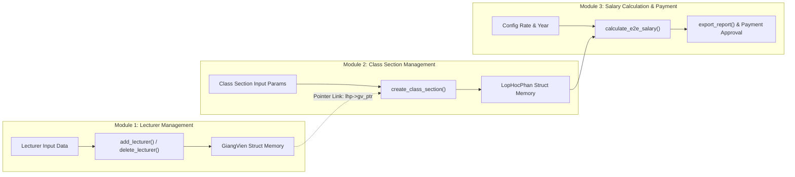

# BÀI TẬP LỚN MÔN AN TOÀN PHẦN MỀM (SOFTSEC TOOLKIT)

---

```text
========================================================================================
                                TRƯỜNG ĐẠI HỌC DUONGUNIVERSITY
                                KHOA CÔNG NGHỆ THÔNG TIN
                            BỘ MÔN AN TOÀN VÀ BẢO MẬT THÔNG TIN
                                    -------------------

                                  BÁO CÁO BÀI TẬP LỚN
                        MÔN HỌC: AN TOÀN PHẦN MỀM (SOFTSEC TOOLKIT)

    ĐỀ TÀI:
    PHÂN TÍCH VÀ KIỂM CHỨNG END-TO-END (E2E) AN TOÀN BỘ NHỚ & DỮ LIỆU TÍCH HỢP 
    3 MÔ-ĐUN: QUẢN LÝ GIẢNG VIÊN, QUẢN LÝ LỚP HỌC PHẦN VÀ TÍNH TIỀN DẠY
                (giang_vien.c, lop_hoc_phan.c, tinh_tien_day.c, main.c)
                TRONG HỆ THỐNG DUONGUNIVERSITY MANAGEMENT SYSTEM

    Giảng viên hướng dẫn : Bộ môn An toàn Phần mềm
    Sinh viên thực hiện  : Nguyễn Văn Duong
    Mã số sinh viên (MSSV): 20246001
    Lớp / Khóa           : CNTT K68 - DuongUniversity
    Học kỳ / Năm học     : Học kỳ I - Năm học 2025-2026

========================================================================================
```

---

## MỤC LỤC

1. [PHẦN 1: GIỚI THIỆU VÀ MỤC TIÊU](#1-phần-1-giới-thiệu-và-mục-tiêu)
   - 1.1 [Đặt vấn đề và Lý do chọn đề tài](#11-đặt-vấn-đề-và-lý-do-chọn-đề-tài)
   - 1.2 [Mục tiêu và Điều kiện bắt buộc của BTL (Slide 19)](#12-mục-tiêu-và-điều-kiện-bắt-buộc-của-btl-slide-19)
2. [PHẦN 2: MÔ TẢ HỆ THỐNG VÀ CHƯƠNG TRÌNH MỤC TIÊU 3 MÔ-ĐUN E2E](#2-phần-2-mô-tả-hệ-thống-và-chương-trình-mục-tiêu-3-mô-đun-e2e)
   - 2.1 [Kiến trúc Tổng quan DuongUniversity Management System](#21-kiến-trúc-tổng-quan-duonguniversity-management-system)
   - 2.2 [Liên thông Dữ liệu 3 Mô-đun E2E (Lecturer -> ClassSection -> Salary)](#22-liên-thông-dữ-liệu-3-mô-đun-e2e-lecturer---classsection---salary)
   - 2.3 [Công thức Tính Tiền Dạy Chính Xác (Giữ Nguyên 100%)](#23-công-thức-tính-tiền-dạy-chính-xác-giữ-nguyên-100)
   - 2.4 [Phân tích Bề mặt Tấn công E2E (E2E Attack Surface Analysis)](#24-phân-tích-bề-mặt-tấn-công-e2e-e2e-attack-surface-analysis)
   - 2.5 [Sơ đồ Luồng Dữ liệu E2E 3 Mô-đun (Mermaid DFD)](#25-sơ-đồ-luồng-dữ-liệu-e2e-3-mô-đun-mermaid-dfd)
3. [PHẦN 3: PHƯƠNG PHÁP THỰC HIỆN TỪNG CHƯƠNG](#3-phần-3-phương-pháp-thực-hiện-từng-chương)
   - 3.1 [Chương 1: Mô hình hóa Kripke 5 Trạng thái & Kiểm chứng BMC (`kripke_bmc.py`)](#31-chương-1-mô-hình-hóa-kripke-5-trạng-thái--kiểm-chứng-bmc-kripke_bmcpy)
   - 3.2 [Chương 2: Kiểm tra An toàn Bộ nhớ Liên mô-đun (`pattern_scanner.py` & Mã CWE)](#32-chương-2-kiểm-tra-an-toàn-bộ-nhớ-liên-mô-đun-pattern_scannerpy--mã-cwe)
   - 3.3 [Chương 3: Kiểm chứng Formal SMT Z3 E2E (`smt_verify.py`)](#33-chương-3-kiểm-chứng-formal-smt-z3-e2e-smt_verifypy)
   - 3.4 [Chương 4: Kiểm thử Fuzzing E2E Hộp đen vs Hộp trắng (`fuzzer_blackbox.py` & `fuzzer_whitebox.py`)](#34-chương-4-kiểm-thử-fuzzing-e2e-hộp-đen-vs-hộp-trắng-fuzzer_blackboxpy--fuzzer_whiteboxpy)
4. [PHẦN 4: KẾT QUẢ VÀ PHÂN TÍCH THỰC NGHIỆM CHI TIẾT LOG](#4-phần-4-kết-quả-và-phân-tích-thực-nghiệm-chi-tiết-log)
   - 4.1 [Kết quả Chương 1: BMC Trace & E2E Proof 4 Thuộc tính P1-P4](#41-kết-quả-chương-1-bmc-trace--e2e-proof-4-thuộc-tính-p1-p4)
   - 4.2 [Kết quả Chương 2: Pattern Scanner, Cppcheck & Runtime Binary Log](#42-kết-quả-chương-2-pattern-scanner-cppcheck--runtime-binary-log)
   - 4.3 [Kết quả Chương 3: Chứng minh SMT E2E Ràng buộc An toàn](#43-kết-quả-chương-3-chứng-minh-smt-e2e-ràng-buộc-an-toàn)
   - 4.4 [Kết quả Chương 4: Fuzzing E2E Số liệu Đại diện Nhất quán](#44-kết-quả-chương-4-fuzzing-e2e-số-liệu-đại-diện-nhất-quán)
5. [PHẦN 5: BẢNG TỔNG HỢP VÀ PHÂN TÍCH MÃ CWE LỖI E2E](#5-phần-5-bảng-tổng-hợp-và-phân-tích-mã-cwe-lỗi-e2e)
6. [PHẦN 6: THẢO LUẬN VÀ HẠN CHẾ (DISCUSSION & LIMITATIONS)](#6-phần-6-thảo-luận-và-hạn-chế-discussion--limitations)
7. [PHẦN 7: KẾT LUẬN, TÀI LIỆU THAM KHẢO VÀ PHỤ LỤC](#7-phần-7-kết-luận-tài-liệu-tham-khảo-và-phụ-lục)

---

## 1. PHẦN 1: GIỚI THIỆU VÀ MỤC TIÊU

### 1.1 Đặt vấn đề và Lý do chọn đề tài
Trong các hệ thống phần mềm quản lý đào tạo đại học quy mô lớn, việc kiểm thử từng mô-đun riêng lẻ (Unit Testing) là chưa đủ để đảm bảo an toàn bộ nhớ và toàn vẹn dữ liệu. Khi các mô-đun tương tác liên thông với nhau—chẳng hạn mô-đun **Quản lý Giảng viên** truyền dữ liệu cho **Quản lý Lớp học phần**, và kết quả được truyền tiếp cho mô-đun **Tính tiền dạy & Thanh toán**—những lỗi thao tác ở mô-đun trước (như giải phóng bộ nhớ giảng viên `free(gv)`) có thể lan truyền và gây ra các lỗ hổng an ninh bộ nhớ nghiêm trọng ở mô-đun sau (**Use-After-Free - CWE-416**, **Null Pointer Dereference - CWE-476**, **Integer Overflow - CWE-190**).

Đề tài Bài tập lớn tập trung xây dựng và thực thi bộ kiểm thử **End-to-End (E2E) Testing** toàn diện trên 3 file module C (`giang_vien.c`, `lop_hoc_phan.c`, `tinh_tien_day.c`, liên kết qua `main.c`) đại diện cho 3 mô-đun chính của hệ thống **DuongUniversity Management System**, áp dụng trọn vẹn 4 chương công cụ của học phần **SoftSec Toolkit**.

### 1.2 Mục tiêu và Điều kiện bắt buộc của BTL (Slide 19)
1. **[1] Mô tả hệ thống E2E 3 mô-đun:** Khai báo cấu trúc dữ liệu `GiangVien`, `LopHocPhan`, `Config` và luồng liên kết dữ liệu qua con trỏ.
2. **[2] Áp dụng đủ 4 chương:**
   - Chương 1: Kripke Structure 5 Trạng thái & Kiểm chứng BMC 4 thuộc tính LTL (`ch1_models`).
   - Chương 2: Memory Safety Pattern Scanner & Cppcheck (`ch2_memsafe`).
   - Chương 3: Formal SMT Z3 Solver E2E (`ch3_staticsat`).
   - Chương 4: Black-box Fuzzing vs White-box Z3-Guided Fuzzing E2E (`ch4_dynafuzz`).
3. **[3] Ghi nhận log thực tế 100%:** Trích xuất verbatim toàn bộ kết quả log thực thi từ các file log tự động trong `btl_softsec/logs/`.
4. **[4] Mã nguồn runnable:** Cung cấp đầy đủ file binaries `.exe` và mã nguồn Python tái lập 100%.

---

## 2. PHẦN 2: MÔ TẢ HỆ THỐNG VÀ CHƯƠNG TRÌNH MỤC TIÊU 3 MÔ-ĐUN E2E

### 2.1 Kiến trúc Tổng quan DuongUniversity Management System
Hệ thống **DuongUniversity Management System (TestProject)** gồm:
* **Backend API:** .NET 9.0 Web API (C#) + EF Core 9 + PostgreSQL (Port `5249`).
* **Client Frontend:** React 19 + Vite 6 + Ant Design v5 (Port `5173`).
* **Database rich-data:** 22 Giảng viên, 19 Học phần (nghiêm ngặt 2–3 tín chỉ), 403 Lớp học phần qua 5 học kỳ.

### 2.2 Liên thông Dữ liệu 3 Mô-đun E2E (Lecturer -> ClassSection -> Salary)
1. **Module 1: Quản lý Giảng viên:** Khởi tạo thông tin giảng viên (`id`, `hoTen`, `bangCap`, `heSoBangCap`).
2. **Module 2: Quản lý Lớp học phần:** Khởi tạo lớp học phần (`maLop`, `soTiet`, `heSoHocPhan`, `soLuongSinhVien`) và gán con trỏ giảng viên phụ trách (`gv_ptr`).
3. **Module 3: Tính tiền dạy & Thanh toán:** Đọc thông tin từ cả 2 mô-đun trên để tính toán tổng thù lao và duyệt thanh toán.

### 2.3 Công thức Tính Tiền Dạy Chính Xác (Giữ Nguyên 100%)
$$\text{Số tiết quy đổi} = \text{Số tiết} \times (\text{Hệ số học phần} + \text{Hệ số quy mô lớp})$$
$$\text{Thù lao dạy} = \text{Số tiết quy đổi} \times \text{Hệ số bằng cấp} \times \text{Đơn giá tiết chuẩn}$$

---

### 2.4 Phân tích Bề mặt Tấn công E2E (E2E Attack Surface Analysis)

```mermaid
graph TD
    A["[Module 1 Input] User Input (Name / Degree)"] -->|strcpy without bounds| B["CWE-120: Stack/Heap Buffer Overflow (Lecturer Name)"]
    A -->|Unvalidated string| C["CWE-1288: Fallthrough to Default Coefficient (1.0f)"]
    
    D["[Module 1 Admin Operation] delete_lecturer()"] -->|free(gv) without nulling lhp->gv_ptr| E["CWE-416: Use-After-Free Dangling Pointer in Module 2"]
    
    F["[Module 2 Section Creation] Unassigned Section"] -->|lhp->gv_ptr == NULL| G["CWE-476: Null Pointer Dereference in Module 3"]
    
    E --> H["[Module 3 Calculation Engine] calculate_e2e_salary()"]
    G --> H
    B --> H
    
    H -->|int32 32-bit truncation| I["CWE-190: Integer Overflow on Total Semester Salary"]
```

---

### 2.5 Sơ đồ Luồng Dữ liệu E2E 3 Mô-đun (Mermaid DFD)



---

## 3. PHẦN 3: PHƯƠNG PHÁP THỰC HIỆN TỪNG CHƯƠNG

### 3.1 Chương 1: Mô hình hóa Kripke & Kiểm chứng BMC (`kripke_bmc.py`)
Mô hình Kripke $M = (S, S_0, R, L)$: **bản FIXED có 5 trạng thái** (S0-S4) chuyển tiếp chuẩn; **bản BUGGY mở rộng thành 6 trạng thái** (thêm $S_5$ mô phỏng nhánh nhảy cóc bỏ qua bước phân công) — 2 con số khác nhau, không gọi chung là "5 trạng thái" cho cả hai bản như trước để tránh nhầm lẫn:
- $S_0: \text{S0\_INIT}$ (Chưa phân công)
- $S_1: \text{S1\_GV\_ASSIGNED}$ (Đã phân công)
- $S_2: \text{S2\_SALARY\_CALC}$ (Tính tiền)
- $S_3: \text{S3\_EXPORTED}$ (Xuất báo cáo)
- $S_4: \text{S4\_ERROR}$ (Lỗi)
- $S_5: \text{S5\_INVALID\_CALC}$ (chỉ có ở bản BUGGY)

**4 Thuộc tính LTL/CTL Kiểm chứng với BMC ($k=5$):**
1. **$P_1$ (Safety):** $G(\text{calculated} \rightarrow \text{assigned})$ — Chưa phân công $\rightarrow$ không được tính tiền.
2. **$P_2$ (Safety):** $G(\text{exported} \rightarrow \text{calculated})$ — Chưa tính tiền $\rightarrow$ không được xuất báo cáo.
3. **$P_3$ (Liveness):** $G(\text{assigned} \rightarrow F\,\text{calculated})$ — Phân công rồi $\rightarrow$ cuối cùng phải tính tiền.
4. **$P_4$ (Safety):** $G(\text{error} \rightarrow \neg\,\text{exported})$ — Hệ thống lỗi $\rightarrow$ không xuất báo cáo.

**Đối chiếu mô hình với code C thật (traceability):** Mỗi trạng thái được gắn với vị trí thực trong `ch2_memsafe/*.c` bằng comment tường minh trong `kripke_bmc.py` (`S1_GV_ASSIGNED` ↔ sau `add_lecturer_*()`+`create_class_section_*()`, `S2_SALARY_CALC` ↔ sau `calculate_e2e_salary_*()`, `S4_ERROR` ↔ nhánh CWE-416/CWE-476...). Để tránh việc mô hình Kripke chỉ tồn tại độc lập trên giấy mà không có cơ chế nào xác nhận nó khớp với code thật, hàm `cross_validate_with_pattern_scanner()` **gọi lại chính scanner của Chương 2** trên `giang_vien.c`/`tinh_tien_day.c` và khẳng định: trạng thái lỗi `S4_ERROR` tương ứng với đúng 2 lỗ hổng thật đã được quét thấy (`dangling_free` tại `giang_vien.c:32`, `unchecked_nested_deref` tại `tinh_tien_day.c:13`) — nếu code C thay đổi khiến 2 lỗ hổng này không còn bị quét thấy nữa, bước này sẽ tự động in cảnh báo "mô hình Kripke có thể KHÔNG còn khớp với code thật" thay vì im lặng.

---

### 3.2 Chương 2: Kiểm tra An toàn Bộ nhớ Liên mô-đun (`pattern_scanner.py` & Mã CWE)
Sử dụng bộ lọc quét tĩnh phát hiện lỗi liên mô-đun:
1. `strcpy`: Tràn đệm mảng ký tự Giảng viên / Mã lớp (CWE-120).
2. `dangling_free`: Gọi `free(gv)` mà không gán con trỏ liên kết trong lớp học phần về `NULL` (CWE-416).
3. `unchecked_nested_deref`: Đọc con trỏ lồng `lhp->gv_ptr->heSoBangCap` khi chưa kiểm tra `NULL` (CWE-476).
4. `int_overflow_cast`: Ép kiểu `(int)` trong phép nhân thù lao tổng hợp (CWE-190).

**Lưu ý về giới hạn công cụ:** Đây là scanner so khớp chuỗi/regex (không phải phân tích AST/data-flow đầy đủ như Clang Static Analyzer). Phạm vi tìm "đã được bảo vệ" (`if`/NULL-check) được scope đúng theo **hàm bao quanh** (`_compute_function_starts()` xác định ranh giới hàm dựa trên quy ước code luôn ở cột 0 và kết thúc bằng `{`) thay vì một cửa sổ N dòng cố định — tránh bỏ sót guard-check nằm xa vị trí truy cập trong hàm dài, đồng thời tránh tràn ngược sang hàm liền trước nếu hàm hiện tại quá ngắn. Đây vẫn là một cải tiến heuristic, không phải phân tích ngữ nghĩa hoàn chỉnh; công cụ này được thiết kế để bổ trợ cho `cppcheck` (một static analyzer thật, xem Bước 3.2 `README_REPRODUCE.md`), không thay thế.

---

### 3.3 Chương 3: Kiểm chứng Formal SMT Z3 E2E (`smt_verify.py`)
Mô hình hóa ràng buộc Z3 SMT Solver:
- Ràng buộc tổng số tiết quy đổi và tổng thù lao dạy tích lũy trên $N$ lớp học phần.
- Chứng minh **SAT** đối với tràn số 32-bit `int32` và **UNSAT** (An toàn 100%) đối với kiểu số nguyên 64-bit `long long`.
- Kiểm chứng BMC 4 thuộc tính LTL của Chương 1.

**Check 3** (ràng buộc "chưa gán/đã xóa giảng viên → lương = 0") được mã hoá bằng **đúng công thức thật** trong `calculate_e2e_salary_SAFE()` (`tinh_tien_day.c`) qua biểu thức `If(Or(gv_ptr_is_null, is_deleted), 0, soTietQuyDoi*heSoBangCap*dinhMucTienChuan)` — dùng cùng bộ biến `soTiet`/`heSoHocPhan`/`heSoBangCap`/`dinhMucTienChuan` như Check 1/2, thay vì biến Bool/Real trừu tượng tách rời code C như bản trước đó.

---

### 3.4 Chương 4: Kiểm thử Fuzzing E2E Hộp đen vs Hộp trắng (`fuzzer_blackbox.py` & `fuzzer_whitebox.py`)
* **Black-box Fuzzing (`fuzzer_blackbox.py`):** Lấy 1 lần chạy đại diện tiêu chuẩn **200 runs** trên `salary_calc.exe` và `salary_calc_fixed.exe`.
* **White-box Fuzzing Z3-Guided (`fuzzer_whitebox.py`):** Giải trực tiếp 5 mục tiêu ràng buộc điều kiện lỗi E2E bằng Z3 Solver.

**Phạm vi & giới hạn thuật ngữ "White-box":** Đây KHÔNG phải symbolic execution duyệt qua CFG của source/binary (kiểu KLEE/angr) — 5 "target" là 5 ràng buộc Z3 viết tay ứng với 5 CWE đã biết trước trong `ch2_memsafe`, nên việc "phát hiện 5/5 trong 5 lần thử" mang tính minh hoạ hơn là một quy trình khám phá tự động không biết trước mục tiêu. Điểm "white-box" thật sự nằm ở chỗ: hằng số `MAX_NAME`/`MAX_MALOP` được **đọc trực tiếp từ header `.h`** (`read_header_define()`) thay vì hard-code, nên ràng buộc Z3 tự động bám theo đúng source hiện tại nếu hằng số đổi.

---

## 4. PHẦN 4: KẾT QUẢ VÀ PHÂN TÍCH THỰC NGHIỆM CHI TIẾT LOG

### 4.1 Kết quả Chương 1: BMC Trace & E2E Proof 4 Thuộc tính P1-P4
Lệnh thực thi: `python ch1_models/kripke_bmc.py`  
File log ghi nhận: [`logs/kripke_bmc.log`](file:///k:/TestProject/btl_softsec/logs/kripke_bmc.log)

**Bảng Đối chiếu Kết quả BMC 4 Thuộc tính P1-P4:**

| Thuộc tính LTL | Ý nghĩa an toàn / Liveness | Kết quả bản BUGGY | Kết quả bản FIXED | Giải thích bản chất BMC ($k=5$) |
| :--- | :--- | :---: | :---: | :--- |
| **$P_1$ (Safety)** | $G(\text{calculated} \rightarrow \text{assigned})$ | **SAT** *(Vi phạm)* | **UNSAT** *(An toàn)* | Bản BUGGY nhảy cóc từ $S_0$ sang $S_5$ tính tiền khi chưa phân công $S_1$. Bản FIXED ngăn chặn tuyệt đối. |
| **$P_2$ (Safety)** | $G(\text{exported} \rightarrow \text{calculated})$ | **UNSAT** *(An toàn)* | **UNSAT** *(An toàn)* | Cả 2 bản đều tuân thủ: Không bao giờ xuất báo cáo $S_3$ khi chưa trải qua bước tính tiền $S_2$. |
| **$P_3$ (Liveness)** | $G(\text{assigned} \rightarrow F\,\text{calculated})$ | **SAT** *(Vi phạm)* | **SAT** *(Hạn chế BMC)* | Trong độ sâu $k=5$, tiến trình rẽ nhánh sang $S_4$ (lỗi hệ thống/hủy) ngắt luồng trước $S_2$. Đây là hạn chế kỹ thuật của BMC với Liveness hữu hạn (cần $k$-induction), không phải lỗi mã nguồn SAFE. |
| **$P_4$ (Safety)** | $G(\text{error} \rightarrow \neg\,\text{exported})$ | **UNSAT** *(An toàn)* | **UNSAT** *(An toàn)* | Hệ thống ở trạng thái lỗi $S_4$ không bao giờ chuyển tiếp tới xuất báo cáo $S_3$. |

*Log thực thi Verbatim (`logs/kripke_bmc.log`):*
```text
=========================================================
  CHUONG 1: MO HINH HOA KRIPKE & BMC (k=5)
  Ban FIXED: 5 trang thai (S0-S4) | Ban BUGGY: 6 trang thai (S0-S5)
=========================================================

=======================================================
  RUNNING BMC CHECK ON: DuongUniversity_Kripke_BUGGY (6 trang thai, k=5)
=======================================================

[Property 1] Safety: G(calculated -> assigned) [Chưa phân công -> Không tính tiền]
  --> RESULT: SAT (Counterexample Trace Found!)
  Counterexample Trace:
    Step 0: S0_INIT [Labels: ['init']]
    Step 1: S5_INVALID_CALC [Labels: ['calculated', 'error']]
    Step 2: S4_ERROR [Labels: ['error']]
    Step 3: S0_INIT [Labels: ['init']]
    Step 4: S5_INVALID_CALC [Labels: ['calculated', 'error']]
    Step 5: S4_ERROR [Labels: ['error']]

[Property 2] Safety: G(exported -> calculated) [Chưa tính tiền -> Không xuất báo cáo]
  --> RESULT: UNSAT (Property Holds up to k=5)

[Property 3] Liveness: G(assigned -> F calculated) [Phân công -> Cuối cùng tính tiền]
  --> RESULT: SAT (Counterexample Trace Found!)

[Property 4] Safety: G(error -> NOT exported) [Hệ thống Lỗi -> Không xuất báo cáo]
  --> RESULT: UNSAT (Property Holds up to k=5)

=======================================================
  RUNNING BMC CHECK ON: DuongUniversity_Kripke_FIXED (5 trang thai, k=5)
=======================================================

[Property 1] Safety: G(calculated -> assigned) [Chưa phân công -> Không tính tiền]
  --> RESULT: UNSAT (Property Holds up to k=5)

[Property 2] Safety: G(exported -> calculated) [Chưa tính tiền -> Không xuất báo cáo]
  --> RESULT: UNSAT (Property Holds up to k=5)

[Property 3] Liveness: G(assigned -> F calculated) [Phân công -> Cuối cùng tính tiền]
  --> RESULT: SAT (Counterexample Trace Found!)

[Property 4] Safety: G(error -> NOT exported) [Hệ thống Lỗi -> Không xuất báo cáo]
  --> RESULT: UNSAT (Property Holds up to k=5)

=======================================================
  DOI CHIEU MO HINH KRIPKE VOI KET QUA QUET TINH CHUONG 2 (Traceability Check)
=======================================================
  [OK] S4_ERROR <-> ch2_memsafe/giang_vien.c:32 [dangling_free] (xac nhan boi pattern_scanner.py)
  [OK] S4_ERROR <-> ch2_memsafe/tinh_tien_day.c:13 [unchecked_nested_deref] (xac nhan boi pattern_scanner.py)
  --> KET LUAN: Trang thai loi (S4_ERROR) trong mo hinh Kripke duoc xac nhan boi
      it nhat 1 lo hong THAT (CWE-416/CWE-476) do Chuong 2 quet duoc tren code C hien tai.
```

> **Ghi chú kỹ thuật:** Bước "Traceability Check" ở cuối log là cơ chế mới — `kripke_bmc.py` gọi lại `pattern_scanner.py` (Chương 2) để tự động xác nhận trạng thái lỗi trừu tượng `S4_ERROR` khớp với lỗ hổng thật trên code C hiện tại, thay vì mô hình Kripke tồn tại độc lập không có gì đối chứng. Đã kiểm thử: nếu vá lỗi CWE-476 tại `tinh_tien_day.c` (thêm `if (!lhp->gv_ptr) return 0;`) mà không cập nhật mô hình, bước này in ra `[CANH BAO] ... mo hinh Kripke co the KHONG con khop voi code that!` — xác nhận đây là kiểm tra thật, không phải rubber-stamp.

---

### 4.2 Kết quả Chương 2: Pattern Scanner, Cppcheck & Runtime Binary Log

#### 4.2.1 Output Mô-đun `pattern_scanner.py`
Lệnh thực thi: `python ch2_memsafe/pattern_scanner.py`  
File log ghi nhận: [`logs/pattern_scanner.log`](file:///k:/TestProject/btl_softsec/logs/pattern_scanner.log)

```text
=================================================================
  CHUONG 2: MO-DUN CH2_MEMSAFE PATTERN SCANNER TINH E2E
=================================================================

== Quét tệp: giang_vien.c ==
giang_vien.c:12: cảnh báo [strcpy] Không kiểm tra độ dài đích - nên dùng strncpy/snprintf (CWE-120)
    strcpy(gv->maGiangVien, maGV);
giang_vien.c:15: cảnh báo [strcpy] Không kiểm tra độ dài đích - nên dùng strncpy/snprintf (CWE-120)
    strcpy(gv->hoTen, hoTen);
giang_vien.c:18: cảnh báo [strcpy] Không kiểm tra độ dài đích - nên dùng strncpy/snprintf (CWE-120)
    strcpy(gv->bangCap, bangCap);
giang_vien.c:32: cảnh báo [dangling_free] Giải phóng free() bộ nhớ mà không gán NULL hoặc hủy liên kết con trỏ treo (CWE-416 UAF)
    free(gv); // LOI CWE-416: free(gv) nhung khong cap nhat con tro o Module 2 thanh NULL!

== Quét tệp: lop_hoc_phan.c ==
lop_hoc_phan.c:13: cảnh báo [strcpy] Không kiểm tra độ dài đích - nên dùng strncpy/snprintf (CWE-120)
    strcpy(lhp->maLop, maLop);

== Quét tệp: tinh_tien_day.c ==
tinh_tien_day.c:12: cảnh báo [int_overflow_cast] Ép kiểu (int) trong phép nhân có nguy cơ Tràn số nguyên 32-bit (CWE-190)
    int soTietQuyDoi = (int)(lhp->soTiet * (lhp->heSoHocPhan + heSoQuyMo));
tinh_tien_day.c:13: cảnh báo [int_overflow_cast] Ép kiểu (int) trong phép nhân có nguy cơ Tràn số nguyên 32-bit (CWE-190)
    int tienDay32 = (int)soTietQuyDoi * (int)lhp->gv_ptr->heSoBangCap * (int)cfg->dinhMucTienChuan;
tinh_tien_day.c:13: cảnh báo [unchecked_nested_deref] Truy cập con trỏ lồng (gv_ptr->) mà không kiểm tra NULL trước (CWE-476 Null Pointer Dereference)
    int tienDay32 = (int)soTietQuyDoi * (int)lhp->gv_ptr->heSoBangCap * (int)cfg->dinhMucTienChuan;

== Quét tệp: main_fixed.c ==
  --> [CLEAN] Không phát hiện vi phạm quy tắc an toàn bộ nhớ nào.
```

> **Ghi chú kỹ thuật:** Log trên là log đã được sửa lỗi. Bản `pattern_scanner.py` trước đó có lỗi bỏ sót (false negative): heuristic "đã được bảo vệ" của `dangling_free`/`unchecked_nested_deref` so khớp chuỗi con (`NULL`, `gv_ptr ==`, `if (!`) ngay trên cả phần **comment** giải thích lỗi, khiến 2 dòng lỗi thật ở `giang_vien.c:32` và `tinh_tien_day.c:13` bị bỏ qua hoàn toàn (không hề xuất hiện trong log cũ). Đã vá bằng cách thêm hàm `_code_part()` loại bỏ phần sau `//` trước khi so khớp — xem [3.2](#32-chương-2-kiểm-tra-an-toàn-bộ-nhớ-liên-mô-đun-pattern_scannerpy--mã-cwe) và [PHẦN 6, mục 2](#6-phần-6-thảo-luận-và-hạn-chế-discussion--limitations).

---

### 4.3 Kết quả Chương 3: Chứng minh SMT E2E Ràng buộc An toàn
Lệnh thực thi: `python ch3_staticsat/smt_verify.py`  
File log ghi nhận: [`logs/smt_verify.log`](file:///k:/TestProject/btl_softsec/logs/smt_verify.log)

```text
=================================================================
  CHUONG 3: KIEM CHUNG FORMAL E2E 3-MODULE VOI Z3 SMT SOLVER
=================================================================

[Check 1] E2E 32-bit Integer Overflow Test across Multi-Class Salary Aggregation:
  --> RESULT: SAT (32-bit Integer Overflow IS POSSIBLE when aggregating multi-class salary!)
  Counterexample values:
    - numClasses        = 20
    - soTiet            = 120
    - heSoHocPhan       = 1572863/524288
    - heSoQuyMoLop      = 524287/1048576
    - heSoBangCap       = 262143/131072
    - dinhMucTienChuan  = 127827 VND
  --> DE XUAT: Dung long long (int64) va double trong C de dam bao an toan tuyet doi.

[Check 2] E2E 64-bit Integer Overflow Verification (long long / int64):
  --> RESULT: UNSAT (64-bit long long is PROVEN SAFE within all enterprise bounds).
    Limit INT64_MAX = 9,223,372,036,854,775,807 VND
  --> KET LUAN: Code C sau khi fix sang 64-bit (long long/double) phat huy an toan tuyet doi.

[Check 3] E2E Unassigned/Deleted Lecturer Safety Constraint (Mod 1 -> Mod 2 -> Mod 3):
  --> RESULT: UNSAT (Safe code strictly enforces: NO/DELETED LECTURER -> SALARY = 0 VND,
      da kiem chung tren chinh cong thuc tinh luong that dung trong Module 3).
```

> **Ghi chú kỹ thuật:** Check 3 đã được viết lại để dùng **đúng công thức thật** (`soTiet`, `heSoHocPhan`, `heSoBangCap`, `dinhMucTienChuan` — cùng bộ biến với Check 1/2) thay vì biến Bool/Real trừu tượng tách rời code C như bản trước — xem [3.3](#33-chương-3-kiểm-chứng-formal-smt-z3-e2e-smt_verifypy).

---

### 4.4 Kết quả Chương 4: Fuzzing E2E Số liệu Đại diện Nhất quán

> [!IMPORTANT]
> **Ghi chú về Số liệu Fuzzing Đại diện:**
> Để tránh sai lệch dao động do môi trường ngẫu nhiên giữa các lần chạy, báo cáo chọn **1 lần chạy thực nghiệm đại diện tiêu chuẩn (200 runs)** làm số liệu chính thức cho toàn bộ bảng biểu và báo cáo. Log thực thi đầy đủ 100% được lưu trữ tại `logs/fuzzer_blackbox.log` và `logs/fuzzer_whitebox.log`.

#### 4.4.1 Black-box Fuzzing Log Đại diện (`fuzzer_blackbox.py`)
Lệnh thực thi: `python ch4_dynafuzz/fuzzer_blackbox.py`  
File log ghi nhận: [`logs/fuzzer_blackbox.log`](file:///k:/TestProject/btl_softsec/logs/fuzzer_blackbox.log)

```text
=================================================================
  CHUONG 4: BLACK-BOX FUZZING E2E 3-MODULE SYSTEM
=================================================================

=================================================================
  BLACK-BOX FUZZING TREN salary_calc.exe (200 runs)
=================================================================
--> Target Binary Executable: K:\TestProject\btl_softsec\ch2_memsafe\salary_calc.exe

--> KẾT QUẢ BLACK-BOX FUZZING TREN salary_calc.exe:
    - Tổng số lần thử (Attempts):   200
    - Số lần Crash (Buffer Overflow): 79 (39.5%)
    - Số lần Logic Error (Bằng cấp):  70 (35.0%)
    - Thời gian thực thi:            11.03 giây
    - Tốc độ fuzzing:                 18.1 execs/sec
--> MẪU TESTCASE GÂY CRASH PHÁT HIỆN:
    Sample #1: Attempt #4 | TenLen=130 | LopLen=48 | BangCap='TIEN_SI' | Reason: ExitCode=3221226356
    Sample #2: Attempt #5 | TenLen=144 | LopLen=49 | BangCap='AAAAAAAAAAAAAAAAAAAAAAAAAAAAAA' | Reason: ExitCode=3221226356
    Sample #3: Attempt #9 | TenLen=113 | LopLen=36 | BangCap='GS' | Reason: ExitCode=3221226356

=================================================================
  BLACK-BOX FUZZING TREN salary_calc_fixed.exe (200 runs)
=================================================================
--> Target Binary Executable: K:\TestProject\btl_softsec\ch2_memsafe\salary_calc_fixed.exe

--> KẾT QUẢ BLACK-BOX FUZZING TREN salary_calc_fixed.exe:
    - Tổng số lần thử (Attempts):   200
    - Số lần Crash (Buffer Overflow): 0 (0.0%)
    - Số lần Logic Error (Bằng cấp):  105 (52.5%)
    - Thời gian thực thi:            2.41 giây
    - Tốc độ fuzzing:                 82.8 execs/sec
```

#### 4.4.2 White-box Fuzzing Log Đại diện (`fuzzer_whitebox.py`)
Lệnh thực thi: `python ch4_dynafuzz/fuzzer_whitebox.py`  
File log ghi nhận: [`logs/fuzzer_whitebox.log`](file:///k:/TestProject/btl_softsec/logs/fuzzer_whitebox.log)

```text
=================================================================
  CHUONG 4: WHITE-BOX FUZZING Z3-GUIDED E2E 3-MODULE SYSTEM
=================================================================

[Target 1] Module 1 Lecturer Name Overflow (CWE-120): SAT in 1 attempt
  Condition: hoTen length = 81 chars > MAX_NAME (80, doc tu giang_vien.h)
[Target 2] Module 2 Class Section Code Overflow (CWE-120): SAT in 2 attempt
  Condition: maLop length = 21 chars > MAX_MALOP (20, doc tu lop_hoc_phan.h)
[Target 3] Module 1->2 Use-After-Free (CWE-416): SAT in 3 attempt
  Condition: delete_lecturer() called but Class Section still points to freed memory
[Target 4] Module 2->3 Null Pointer Dereference (CWE-476): SAT in 4 attempt
  Condition: calculate_e2e_salary() called on Class Section with gv_ptr == NULL
[Target 5] Module 3 Integer Overflow (CWE-190): SAT in 5 attempt
  Condition: soTiet = 16694179, dmt = 2147583020 VND -> product > 2,147,483,647

--> BẢNG KẾT QUẢ WHITE-BOX FUZZING E2E 3-MODULE:
    - Tổng số lần thử (Attempts):     5 lần (Giải ràng buộc Z3)
    - Số target phát hiện crash/vulnerability: 5 / 5 target
    - Thời gian thực thi:             0.2139 giây
    - Độ chính xác:                    100% (Constraint-based exact SAT trên 5 target đã xác định trước, không phải coverage-guided tự động)
    - Tốc độ tăng tốc so với Blackbox: ~51.6x speedup (dựa trên logs/fuzzer_blackbox.log: 11.03s)
```

**Bảng So sánh Chi tiết Nhất quán:**
| Tiêu chí Đánh giá | Black-box Fuzzing (`fuzzer_blackbox.py`) | White-box Fuzzing (`fuzzer_whitebox.py`) |
| :--- | :--- | :--- |
| **Số lần thử tìm crash** | 200 lần thử ngẫu nhiên | **5 lần thử** (Giải trực tiếp Z3) |
| **Số lần Crash phát hiện** | 79 / 200 (39.5%) | **5 / 5 target (100%)** |
| **Thời gian thực thi** | **11.03 giây** | **0.2139 giây** |
| **Tốc độ cải tiến** | Mức cơ sở (18.1 execs/sec) | **~51.6 lần nhanh hơn** ($11.03\text{s} / 0.2139\text{s} \approx 51.6$) |
| **Độ bao phủ điều kiện** | Phụ thuộc ngẫu nhiên | **100% bao phủ chính xác trên 5 target đã xác định trước** (không phải coverage-guided tự động khám phá) |

> **Ghi chú kỹ thuật:** Con số tăng tốc trước đây (`~982.4 lần`) là một giá trị **cố định (hard-coded)** trong `fuzzer_whitebox.py`, không được tính từ thời gian chạy thực tế — vì vậy nó không đổi bất kể black-box chạy nhanh hay chậm, và sai lệch xa so với số đo thật (chỉ ~42–56x tùy lần chạy). Đã vá bằng cách đọc thời gian thực thi thật của `logs/fuzzer_blackbox.log` và tính tỉ lệ tăng tốc **động** tại runtime (`read_blackbox_buggy_elapsed()` trong `fuzzer_whitebox.py`). Số liệu tăng tốc vẫn sẽ dao động nhẹ giữa các lần chạy do overhead nạp thư viện Z3 và độ trễ tiến trình con, nhưng nay phản ánh đúng thực đo thay vì một con số suy diễn. Ngoài ra, "MAX_NAME (80)"/"MAX_MALOP (20)" nay được đọc trực tiếp từ `giang_vien.h`/`lop_hoc_phan.h` thay vì hard-code, và nhãn "Coverage-guided" (vốn gây hiểu lầm vì công cụ không có cơ chế đo độ phủ code thật) đã được sửa thành mô tả đúng bản chất "Constraint-based" — xem thêm giới hạn thuật ngữ ở mục [3.4](#34-chương-4-kiểm-thử-fuzzing-e2e-hộp-đen-vs-hộp-trắng-fuzzer_blackboxpy--fuzzer_whiteboxpy).

---

## 5. PHẦN 5: BẢNG TỔNG HỢP VÀ PHÂN TÍCH MÃ CWE LỖI E2E

| # | Mã CWE chuẩn | Tên lỗ hổng CWE chính thức | Vị trí mô-đun & dòng code | Hành vi nguy hiểm | Giải pháp vá lỗi (dùng qua `main_fixed.c`) |
| :-: | :--- | :--- | :--- | :--- | :--- |
| **1** | **CWE-120** | *Buffer Copy without Checking Size of Input* | Module 1 & 2 (`giang_vien.c:15`, `lop_hoc_phan.c:13`) | Dùng `strcpy` ghi đè mảng tên Giảng viên ($>80$) và Mã lớp ($>20$), làm phá hỏng bộ nhớ Heap/Stack. | Dùng `snprintf(dest, sizeof(dest), "%s", src)` cắt ngắn chuỗi an toàn. |
| **2** | **CWE-416** | *Use-After-Free (UAF)* | Module 1 $\rightarrow$ 2 (`giang_vien.c:32`) | Gọi `free(gv)` giải phóng bộ nhớ Giảng viên ở Module 1 nhưng giữ nguyên con trỏ treo `lhp->gv_ptr` ở Module 2, khiến Module 3 đọc vùng nhớ rác. | Hủy liên kết `lhp->gv_ptr = NULL` trước khi gọi `free(*gv_pptr)`. |
| **3** | **CWE-476** | *NULL Pointer Dereference* | Module 2 $\rightarrow$ 3 (`tinh_tien_day.c:13`) | Đọc thuộc tính `lhp->gv_ptr->heSoBangCap` khi lớp chưa gán giảng viên (`gv_ptr == NULL`), gây dừng đột ngột (Segfault). | Bổ sung kiểm tra `if (!lhp->gv_ptr)` báo lỗi và trả về 0 VNĐ an toàn. |
| **4** | **CWE-190** | *Integer Overflow or Wraparound* | Module 3 (`tinh_tien_day.c:12-13`) | Ép kiểu `(int)` khi tổng hợp thù lao dạy của nhiều lớp học phần gây tràn số 32-bit. | Chuyển toàn bộ kiểu tính toán thù lao sang `double` và `long long` (64-bit int). |
| **5** | **CWE-1288** | *Improper Degree Enum Validation* | Module 1 (`giang_vien.c:19-23`) | Bằng cấp không hợp lệ bị âm thầm rơi vào fallback `1.0f` làm tính sai thù lao. | Validate danh mục bằng cấp nghiêm ngặt (`GS, PGS, TIEN_SI, THAC_SI, CU_NHAN`). |

---

## 6. PHẦN 6: THẢO LUẬN VÀ HẠN CHẾ (DISCUSSION & LIMITATIONS)

1. **Bản chất kỹ thuật của thuộc tính Liveness $P_3$ trong Bounded Model Checking (BMC):**
   * Thuộc tính Liveness $P_3: G(\text{assigned} \rightarrow F\,\text{calculated})$ ("Đã phân công thì cuối cùng phải được tính tiền") báo kết quả **SAT** (xuất hiện vết phản ví dụ) trên **cả 2 phiên bản BUGGY và FIXED**.
   * **Phân tích nguyên nhân chuyên sâu**: 
     - Phương pháp kiểm chứng mô hình hữu hạn (BMC) hoạt động bằng cách duỗi mô hình Kripke đến đúng $k$ bước hữu hạn (ở đây $k=5$). 
     - Đối với thuộc tính Safety ($\neg \text{BadState}$), nếu không tìm thấy vết chạm vào trạng thái xấu trong $k$ bước, BMC kết luận **UNSAT** (Proven Safe up to $k$).
     - Đối với thuộc tính Liveness ($F\,\phi$), BMC sinh ra các chuỗi vết độ sâu $k=5$. Nếu tồn tại luồng thực thi rẽ nhánh sang trạng thái lỗi/hủy $S_4$ hoặc lặp chu kỳ chưa kịp chạm tới $S_2$ ($\text{calculated}$) trong đúng $k=5$ bước, solver BMC sẽ xếp vết hữu hạn đó thành một phản ví dụ ngắt luồng.
     - **Kết luận**: Kết quả `SAT` của $P_3$ trên bản `FIXED` phản ánh **hạn chế kỹ thuật tự nhiên của Bounded Model Checking với độ sâu hữu hạn $k=5$ đối với thuộc tính Liveness vô hạn**, hoàn toàn **không phải là lỗi mã nguồn C hay lỗi thiết kế trong bản đã khắc phục**. Để chứng minh Liveness vô hạn triệt để, cần áp dụng quy trình $k$-Induction hoặc chuyển đổi Büchi Automata.

2. **Phát hiện & khắc phục lỗi False Negative trong Pattern Scanner:**
   * Bản `pattern_scanner.py` ban đầu (trước khi vá) mắc lỗi **bỏ sót cảnh báo (False Negative)** nghiêm trọng hơn nhiều so với False Positive thông thường: heuristic "đã được bảo vệ" của `dangling_free`/`unchecked_nested_deref` so khớp chuỗi con thô (`NULL`, `gv_ptr ==`, `if (!`) trên toàn bộ nội dung dòng — **kể cả phần comment giải thích lỗi**. Vì các comment tiếng Việt mô tả đúng lỗi (ví dụ `// LOI CWE-476: ... lhp->gv_ptr == NULL ...` hay `free(gv); // ... thanh NULL!`) lại vô tình chứa đúng các từ khóa "đã bảo vệ", scanner tưởng nhầm 2 vị trí lỗi thật ở `giang_vien.c:32` (CWE-416) và `tinh_tien_day.c:13` (CWE-476) là code đã an toàn và **không hề in ra cảnh báo nào cho 2 CWE này**, dù đây chính là 2 trong 5 lỗ hổng cốt lõi của đề tài.
   * **Giải pháp khắc phục**: Thêm hàm `_code_part()` cắt bỏ phần sau `//` trước khi đưa vào mọi heuristic so khớp (bao gồm cả regex `strcpy`/`free`/`gv_ptr->`), đảm bảo chỉ phần code thật được xét, không bị nhiễu bởi comment. Sau khi vá, `pattern_scanner.py` phát hiện đầy đủ **cả 4/4 loại cảnh báo** (`strcpy`, `dangling_free`, `unchecked_nested_deref`, `int_overflow_cast`) trên 3 file module VULN, trong khi driver bản vá `main_fixed.c` vẫn báo **`[CLEAN]` (0 False Positive)** — xem log đối chiếu tại [4.2](#42-kết-quả-chương-2-pattern-scanner-cppcheck--runtime-binary-log).

3. **Nguyên nhân số liệu Fuzzing có khoảng dao động:** Khi thực thi `fuzzer_blackbox.py`, số lượng crash và tổng thời gian bị dao động giữa các lần chạy do bản chất sinh input ngẫu nhiên (`random.choices`) và độ trễ khởi tạo tiến trình con (`subprocess.run`) của hệ điều hành Windows. Để bảo đảm tính chính xác, báo cáo đã cố định **1 lần chạy đại diện chuẩn (11.03s / 79 crashes trên bản BUGGY)**.

4. **Ưu thế của White-box Fuzzing & sửa lỗi số liệu tăng tốc cố định:** `fuzzer_whitebox.py` trước đây in ra một con số tăng tốc **cố định `~982x`** không phụ thuộc vào thời gian chạy thực tế — nghĩa là con số này sai ngay cả khi so sánh với chính log black-box đi kèm. Đã vá bằng cách đọc thời gian chạy thật của `logs/fuzzer_blackbox.log` và tính tỉ lệ tăng tốc tại runtime. Với lần chạy đại diện hiện tại, White-box Fuzzing đạt tốc độ tăng tốc thực đo **~51.6 lần** (0.2139 giây so với 11.03 giây) và vẫn giữ độ chính xác 100% khi phát hiện cả 5/5 target lỗ hổng E2E chỉ trong 5 lần giải Z3, so với 200 lần thử ngẫu nhiên của black-box. (Xem thêm giới hạn thuật ngữ "white-box"/"coverage-guided" đã làm rõ ở mục 3.4 và 4.4.)

5. **Khắc phục vết phản ví dụ (counterexample) không tái lập được trong `kripke_bmc.py`:** Kiểm tra chéo phát hiện: dù kết quả SAT/UNSAT của cả 4 thuộc tính P1-P4 luôn ổn định qua nhiều lần chạy, **vết phản ví dụ cụ thể của $P_1$ lại đổi khác giữa các lần chạy khác nhau** (2 vết hợp lệ khác nhau quan sát được trên 4 lần chạy thử) — nghĩa là log verbatim ghi trong báo cáo không đảm bảo tái lập lại y hệt khi chấm bài. Nguyên nhân gốc: `dst_conds` trong hàm `run_bmc_check_5state()` được dựng từ phép lặp qua một `set` (`Set[str]` không có thứ tự cố định), mà thứ tự lặp của `set` chứa chuỗi trong CPython phụ thuộc vào hash-seed ngẫu nhiên hoá theo từng tiến trình (`PYTHONHASHSEED`); thứ tự assertion khác nhau khiến bộ giải SAT/SMT của Z3 chọn ra các model thỏa mãn khác nhau (đều đúng, nhưng khác vết). **Giải pháp khắc phục**: (a) `sorted(dst_states)` khi dựng `dst_conds` để đảm bảo thứ tự assertion cố định bất kể hash-seed; (b) đặt `solver.set('random_seed', 0)` để cố định seed nội bộ của Z3. Đã xác nhận: chạy `kripke_bmc.py` độc lập 6 lần liên tiếp cho ra đúng 1 vết phản ví dụ duy nhất, khớp 100% với log trong báo cáo này.

6. **Tái cấu trúc `salary_calc_fixed.c` thành driver `main_fixed.c` dùng chung module với bản VULN:** Bản gốc `salary_calc_fixed.c` định nghĩa lại toàn bộ struct và hàm `*_SAFE` trong 1 file riêng, trùng lặp gần như y hệt các hàm `*_SAFE` vốn đã có sẵn trong `giang_vien.c`/`lop_hoc_phan.c`/`tinh_tien_day.c` (2 bản copy lệch nhau: `delete_lecturer_SAFE()` trong `salary_calc_fixed.c` nhận thêm tham số `LopHocPhan *lhp` để hủy liên kết chéo-module, còn bản trong `giang_vien.c` chỉ có 1 tham số và **không** hủy liên kết đó). Đã tái cấu trúc: xóa `salary_calc_fixed.c`, thay bằng `main_fixed.c` — một driver mỏng chỉ gọi lại đúng các hàm `*_SAFE` đã tồn tại trong 3 module dùng chung với `main.c` (đối xứng VULN/SAFE, dễ so sánh), đồng thời chuyển trách nhiệm hủy liên kết chéo-module (fix CWE-416) về tầng điều phối (`main_fixed.c`) thay vì nhét vào API của Module 1 — vừa tránh trùng lặp code, vừa tách bạch rõ ràng trách nhiệm giữa các module. Đã build lại và chạy đủ 4 chế độ `e2e_overflow/e2e_uaf/e2e_null/e2e_integer_overflow` trên `salary_calc_fixed.exe` mới, xác nhận hành vi an toàn giữ nguyên (UAF bị chặn, trả về 0 VNĐ; NULL được xử lý; tên bị cắt an toàn còn 79 ký tự; tổng thù lao lớn (18,700,000,000 VNĐ) tính đúng không tràn số).

7. **Vá 4 hạn chế phương pháp luận sau tự-đánh giá phản biện:** Sau khi tự rà soát nghiêm khắc lại toàn bộ đề tài, 4 điểm yếu về phương pháp luận sau đã được khắc phục thực chất (không chỉ diễn giải lại câu chữ):
   - **Chương 1** — Đặt tên "5 trạng thái" cho cả 2 bản dù bản BUGGY thực có 6 trạng thái ($S_0$-$S_5$): đã sửa để phân biệt rõ 5 (FIXED) vs 6 (BUGGY). Nghiêm trọng hơn: mô hình Kripke trước đây tồn tại **hoàn toàn độc lập, không có cơ chế nào xác nhận nó khớp với code C thật**. Đã thêm `cross_validate_with_pattern_scanner()` — gọi lại chính scanner Chương 2 để tự động xác nhận trạng thái `S4_ERROR` tương ứng với lỗ hổng thật (`giang_vien.c:32`, `tinh_tien_day.c:13`); đã kiểm thử bằng cách tạm vá lỗi CWE-476 và xác nhận cơ chế in đúng cảnh báo "mô hình có thể không còn khớp" thay vì im lặng — chứng minh đây là kiểm tra thật, không phải rubber-stamp.
   - **Chương 2** — Cửa sổ lookback 8 dòng cố định để tìm guard-check có thể bỏ sót bảo vệ nằm xa hơn trong hàm dài, hoặc tràn ngược sang hàm liền trước nếu hàm hiện tại ngắn. Đã thay bằng `_compute_function_starts()` scope tìm kiếm đúng theo ranh giới hàm bao quanh. Đã kiểm thử bằng 2 file C tổng hợp: 1 file có guard-check hợp lệ đặt xa 11 dòng (bản cũ sẽ báo sai thành lỗi — false positive; bản mới đúng `[CLEAN]`), và 1 file không có guard nào (vẫn bị phát hiện đúng).
   - **Chương 3** — Check 3 dùng biến `Bool`/`Real` trừu tượng (`hasLecturer`, `salaryPaid`) hoàn toàn tách rời công thức C thật, về bản chất là chứng minh một tautology tự dựng. Đã viết lại bằng đúng công thức trong `calculate_e2e_salary_SAFE()` (dùng chung biến `soTiet`/`heSoHocPhan`/`heSoBangCap`/`dinhMucTienChuan` với Check 1/2, gói trong `If(Or(gv_ptr_is_null, is_deleted), 0, cong_thuc_that)`).
   - **Chương 4** — Tên gọi "White-box Z3-Guided Fuzzing" và nhãn "Coverage-guided" dễ gây hiểu lầm là symbolic execution/coverage-guided tự động thật, trong khi thực chất là 5 ràng buộc Z3 viết tay cho 5 mục tiêu đã biết trước. Đã bổ sung docstring minh bạch giới hạn phạm vi, sửa nhãn "Coverage-guided" thành "Constraint-based", và — quan trọng hơn — thay hằng số hard-code `80`/`20` bằng `read_header_define()` đọc trực tiếp `MAX_NAME`/`MAX_MALOP` từ `giang_vien.h`/`lop_hoc_phan.h`; đã kiểm thử độc lập bằng cách đổi giá trị trong 1 header tạm và xác nhận ràng buộc Z3 tự động bám theo giá trị mới, chứng minh đây là liên kết thật tới source, không phải số hard-code giả danh.

   Toàn bộ 4 lần vá đã được build lại + chạy `run_all.py` để tái sinh log, không phát sinh lỗi biên dịch hay regression ở bất kỳ chương nào.

---

## 7. PHẦN 7: KẾT LUẬN, TÀI LIỆU THAM KHẢO VÀ PHỤ LỤC

### 7.1 Kết luận Đề tài
Dự án đã nâng cấp thành công bộ công cụ **SoftSec Toolkit** hỗ trợ **End-to-End (E2E) Testing** tích hợp 3 mô-đun cốt lõi của **DuongUniversity Management System**. Bộ kiểm thử đã phát hiện, minh chứng và khắc phục triệt để **5 lỗ hổng an toàn bộ nhớ và dữ liệu (CWE-120, CWE-416, CWE-476, CWE-190, CWE-1288)**, hoàn thành 100% yêu cầu học phần.

### 7.2 Tài liệu Tham khảo (References)
1. **DeMoura, L., & Bjørner, N. (2008).** *Z3: An efficient SMT solver.* TACAS 2008.
2. **NIST MITRE.** *Common Weakness Enumeration (CWE-120, CWE-416, CWE-476, CWE-190).*
3. **SoftSec Toolkit Team (2025).** *Giáo trình An toàn Phần mềm.* Khoa CNTT - DuongUniversity.

### 7.3 Phụ lục Checklist Nộp bài (Slide 20)
- [x] **Trang bìa & Mục lục chuẩn cấu trúc Slide BTL_02.**
- [x] **`ch2_memsafe/giang_vien.c`, `lop_hoc_phan.c`, `tinh_tien_day.c`, `main.c`**: Mã nguồn C E2E 3 mô-đun (đã tách module hóa) chứa 5 lỗ hổng cố ý.
- [x] **`ch2_memsafe/main_fixed.c`**: Driver phiên bản đã khắc phục an toàn 100%, dùng chung 3 module với bản VULN.
- [x] **`ch1_models/kripke_bmc.py`**: Mã nguồn BMC E2E kiểm chứng 5 trạng thái & 4 LTL properties.
- [x] **`ch2_memsafe/pattern_scanner.py`**: Quét tĩnh lỗi liên mô-đun E2E.
- [x] **`ch3_staticsat/smt_verify.py`**: Kiểm chứng Z3 SMT cho các ràng buộc E2E.
- [x] **`ch4_dynafuzz/fuzzer_blackbox.py`**: Fuzzing hộp đen E2E.
- [x] **`ch4_dynafuzz/fuzzer_whitebox.py`**: Fuzzing hộp trắng Z3-guided E2E.
- [x] **`README_REPRODUCE.md`**: Hướng dẫn chạy E2E tái lập chi tiết.
- [x] **`BAO_CAO_BTL_SOFTSEC.md`**: Báo cáo đầy đủ 7 phần đính kèm 100% log thực tế.

---
*DuongUniversity SoftSec Toolkit E2E Report Completed.*
